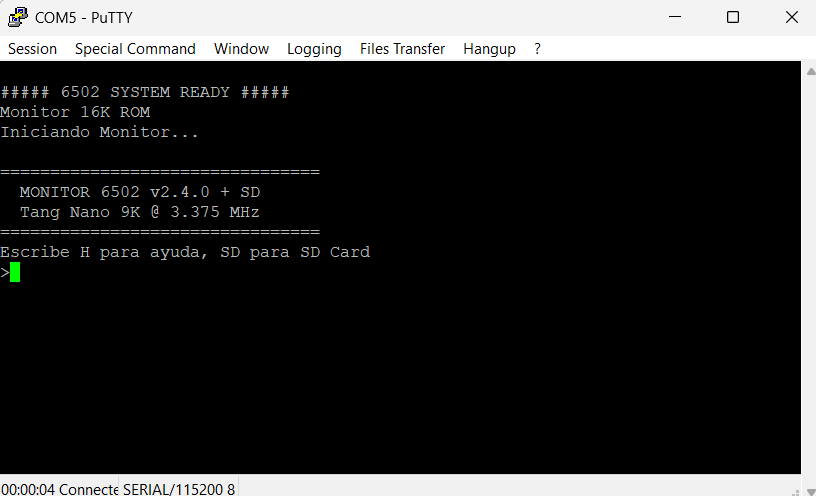

# Monitor 6502 v2.3.0 + SD Card + XMODEM - Tang Nano 9K

🚀 **Monitor/Debugger interactivo** para CPU 6502 sobre FPGA Tang Nano 9K via UART con soporte de **SD Card** y **XMODEM**.

Permite programar, depurar y ejecutar código en tiempo real a través de una interfaz de comandos estilo Wozmon.

## Características

- ✅ CPU 6502 @ 3.375 MHz en FPGA Tang Nano 9K
- ✅ Monitor interactivo via UART (115200 baud)
- ✅ Lectura/escritura de memoria
- ✅ Carga de programas en hexadecimal
- ✅ Ejecución de código en cualquier dirección
- ✅ Desensamblador completo 6502
- ✅ Análisis de memoria RAM (scan, test, mapa visual)
- ✅ **SD Card**: guardar, cargar, listar, eliminar archivos
- ✅ **XMODEM**: transferencia de archivos desde PC
- ✅ **Ayuda contextual** por comando (`H cmd`)
- ✅ Control de 6 LEDs
- ✅ ROM de 16KB
- ✅ Compilación con cc65
- ✅ **Plantillas de programa** incluidas:
  - [examples/leds/](examples/leds) - Ensamblador (Knight Rider)
  - [examples/leds_c/](examples/leds_c) - C con ROM API (3 efectos)
  - [examples/sidplayer/](examples/sidplayer) - Reproductor SID en C

---

## Monitor en Acción



*Monitor 6502 conectado via UART y visualizado en Putty*

---

## Comandos del Monitor

Todo en **HEXADECIMAL** (sin prefijo `$` ni `0x`)

### Comandos Básicos

| Comando | Sintaxis | Descripción |
|---------|----------|-------------|
| **R** | `R [addr]` | Ejecutar programa (default: $0800) |
| **RD** | `RD addr` | Leer byte de memoria |
| **W** | `W addr val` | Escribir byte en memoria |
| **D** | `D addr [len]` | Dump memoria hex+ASCII (default: 64 bytes) |
| **L** | `L addr` | Cargar bytes hex interactivo (terminar con `.`) |
| **F** | `F addr len val` | Llenar memoria con valor |
| **M** | `M addr [n]` | Desensamblar n instrucciones (default: 16) |

### Comandos de Análisis de Memoria

| Comando | Sintaxis | Descripción |
|---------|----------|-------------|
| **I** | `I` | Info del sistema (mapa de memoria) |

### Comandos SD Card

| Comando | Sintaxis | Descripción |
|---------|----------|-------------|
| **SD** | `SD` | Inicializar SD Card |
| **LS** | `LS` | Listar archivos |
| **SAVE** | `SAVE file addr end` | Guardar memoria a archivo |
| **LOAD** | `LOAD file [addr]` | Cargar archivo a memoria (default: $0800) |
| **DEL** | `DEL file` | Eliminar archivo |
| **CAT** | `CAT file` | Ver contenido del archivo en hex |
| **SDFORMAT** | `SDFORMAT` | Formatear SD (borra todo) |

### Comandos XMODEM

| Comando | Sintaxis | Descripción |
|---------|----------|-------------|
| **XRECV** | `XRECV [addr]` | Recibir archivo via XMODEM (default: $0800) |

### Comandos de Ayuda

| Comando | Sintaxis | Descripción |
|---------|----------|-------------|
| **H** | `H` | Ayuda general (lista de comandos) |
| **H** | `H cmd` | Ayuda detallada del comando específico |
| **?** | `?` | Igual que H |
| **Q** | `Q` | Salir/reiniciar monitor |

**Ejemplos de ayuda:**
- `H L` → Ayuda del comando Load
- `H SAVE` → Ayuda del comando Save
- `H D` → Ayuda del comando Dump

---

## Ejemplos de Uso

### Operaciones básicas de memoria
```
>RD 0800         ; Leer byte en $0800
$0800 = $A9

>W 0800 FF       ; Escribir $FF en $0800
$0800 <- $FF

>D 8000 40       ; Dump 64 bytes desde $8000
8000: A9 00 8D 01 C0 A9 C0 8D  03 C0 20 00 90 A2 FF CA  |..........  ....|
```

### Cargar y ejecutar programa
```
>L 0800
Modo carga en $0800 (terminar con '.')
:A9 3F 8D 01 C0 60 .
Cargados 0006 bytes

>M 0800 3
0800  A9 3F     LDA #$3F
0802  8D 01 C0  STA $C001
0805  60        RTS

>R 0800
Ejecutando en $0800...
Retorno de $0800
```


### Usar SD Card
```
>SD
Inicializando SD Card...
  SD OK, tipo: SD
Montando MicroFS...
  FS montado OK

>LS
PROG.BIN      256
TEST.DAT     1024
2 archivos

>SAVE MIPROG.BIN 0800 100
Guardando MIPROG.BIN...
256 bytes guardados

>LOAD MIPROG.BIN
Cargando MIPROG.BIN en $0800...
256 bytes cargados

>R
```

---

## Mapa de Memoria

| Rango | Tamaño | Descripción |
|-------|--------|-------------|
| `$0000-$00FF` | 256 bytes | Zero Page |
| `$0100-$01FF` | 256 bytes | Stack del 6502 |
| `$0200-$07FF` | ~1.5 KB | Variables del monitor (BSS) |
| `$0800-$3DFF` | ~13.5 KB | **RAM usuario** (para programas) |
| `$3E00-$3FFF` | 512 bytes | Stack de CC65 |
| `$C000-$C0FF` | 256 bytes | Puertos I/O |
| `$8000-$BFFF` | 16 KB | ROM (este monitor) |

**RAM libre para programas:** `$0800-$3DFF` (~13.5 KB)

> ⚠️ **Importante**: Los programas deben cargarse desde $0800 para no interferir con los buffers del sistema de archivos.

---

## Hardware Soportado

| Puerto | Dirección | Descripción |
|--------|-----------|-------------|
| LEDs | `$C001` | 6 LEDs (bits 0-5) |
| LED Config | `$C003` | Configuración E/S (0=salida) |
| SPI Data | `$C010` | Datos SPI (SD Card) |
| SPI Status | `$C011` | Estado SPI |
| SPI CS | `$C012` | Chip Select SD |
| UART Data | `$C020` | Datos TX/RX |
| UART Status/Control | `$C021` | Estado UART (lectura) / Control (escritura) |
| UART Baud Low | `$C022` | Divisor baudrate (byte bajo) |
| UART Baud High | `$C023` | Divisor baudrate (byte alto) |
| Timer | `$C030-$C03C` | Timer/RTC de 32-bit (ticks, microsegundos) |

---

## Estructura del Proyecto

```
├── src/
│   ├── main.c              # Programa principal
│   ├── startup.s           # Código de inicio
│   └── simple_vectors.s    # Vectores NMI, RESET, IRQ
├── libs/                   # Librerías (no incluidas, repos separados)
│   ├── monitor/            # Monitor interactivo
│   ├── uart/               # Comunicación UART
│   ├── spi-6502-cc65/      # Bus SPI
│   ├── sdcard-spi-6502-cc65/  # Driver SD Card
│   └── microfs-6502-cc65/  # Sistema de archivos
├── ├── leds/               # Plantilla: efecto Knight Rider (ASM)
│   │   ├── src/main.s      # Código fuente
│   │   ├── config/programa.cfg # Configuración del linker
│   │   ├── makefile        # Compilación
│   │   └── README.md       # Documentación
│   ├── leds_c/             # Plantilla: efectos LEDs (C + ROM API)
│   └── sidplayer/          # Reproductor SID (C + ROM API)
│       └── README.md       # Documentación
├── config/
│   └── fpga.cfg            # Configuración del linker cc65
├── scripts/
│   └── bin2rom3.py         # Conversor BIN → VHDL
├── build/                  # Archivos compilados (generado)
├── output/
│   └── rom.vhd             # ROM generada para FPGA
└── makefile                # Sistema de compilación
```

---

## Instalación

### Requisitos
- [cc65](https://cc65.github.io/) instalado (configurar ruta en makefile)
- Python 3 para el script de conversión
- Librerías en `libs/` (clonar de repos separados):
  - uart
  - spi-6502-cc65
  - sdcard-spi-6502-cc65
  - microfs-6502-cc65
  - monitor

### Compilar
```bash
make
```

### Cargar en FPGA
Copiar `output/rom.vhd` al proyecto FPGA y sintetizar con Gowin EDA.

---s Plantillas (Recomendado)

Existen **tres plantillas** completas según tus necesidades:

#### Plantilla en Ensamblador (`examples/leds/`)
Ideal para programas pequeños y rápidos

### 🚀 Usar la Plantilla (Recomendado)

La carpeta `examples/leds/` contiene una **plantilla completa** para crear programas en ensamblador:

```bash
cd examples/leds
make        # Compilar
make info   # Ver tamaño
make map    # Ver mapa de memoria
```

El programa compilado (`output/leds.bin`) se carga en el monitor:

```
SD                      ; Inicializar SD
LOAD LEDS.BIN           ; Cargar programa (default $0800)
R                       ; Ejecutar
```
 en ASM:**
1. Copia la carpeta `examples/leds/` con otro nombre
2. Edita `src/main.s` con tu código
3. Compila con `make`

Ver [examples/leds/README.md](examples/leds/README.md)

#### Plantilla en C (`examples/leds_c/`)
Ideal para programas complejos usando ROM API:

```bash
cd examples/leds_c
make        # Compilar
make info   # Ver tamaño
```

Características:
- ✅ Usa **ROM API** (UART, Timer hardware)
- ✅ Código en C más fácil de mantener
- ✅ Tres efectos de LEDs con timing preciso
- ✅ Tamaño compacto (~1.2KB)

**Para crear tu propio programa en C:**
1. Copia la carpeta `examples/leds_c/` con otro nombre
2. Edita `src/main.c` con tu código
3. Compila con `make`

Ver [examples/leds_c/README.md](examples/leds_c/README.md)

#### SID Player (`examples/sidplayer/`)
Ejemplo avanzado: reproductor de archivos .sid

Ver [examples/sidplayer/README.md](examples/sidplayer/README.md)

**Para crear tu propio programa:**
1. Copia la carpeta `examples/leds/` con otro nombre
2. Edita `src/main.s` con tu código
3. Compila con `make`

Ver documentación completa en `examples/leds/README.md`

### Mapa de Memoria para Programas

| Rango | Uso |
|-------|-----|
| `$0002-$001F` | Zero Page del Monitor (**NO USAR**) |
| `$0020-$007F` | Zero Page disponible para programas |
| `$0100-$01FF` | Stack del 6502 (compartido) |
| `$0200-$07FF` | BSS del Monitor (**NO USAR**) |
| `$0800-$3DFF` | **RAM para programas** |
| `$3E00-$3FFF` | Stack de CC65 |
| `$C001` | Puerto LEDs (lógica negativa) |

### Programa en Ensamblador (Manual)

```asm
; ejemplo.s
.segment "STARTUP"

LEDS = $C001

start:
    lda #$00        ; Encender todos (lógica negativa)
    sta LEDS
loop:
    jmp loop        ; Loop infinito
```

Compilar:
```bash
ca65 -t none -o ejemplo.o ejemplo.s
ld65 -C examples/leds/config/programa.cfg -o EJEMPLO.BIN ejemplo.o
> **Nota:** El Timer ($C030-$C03C) se accede directamente por hardware, no está en la ROM API.

```

### Cargar y ejecutar
```
>SD
>LOAD EJEMPLO.BIN
>R
```

---

## ROM API (Jump Table)

Los programas standalone pueden llamar funciones de la ROM sin incluir las librerías.
La ROM expone una **jump table** en dirección **$BF00**.

### Referencias de Librerías

Para información detallada sobre el funcionamiento de las funciones, consulta las librerías originales:

- **UART**: [uart-6502-cc65](https://github.com/nelsama/uart-6502-cc65) - Comunicación serial, configuración baudrate
- **MicroFS**: [microfs-6502-cc65](https://github.com/nelsama/microfs-6502-cc65) - Sistema de archivos, operaciones con SD
- **Timer**: [timer-6502-cc65](https://github.com/nelsama/timer-6502-cc65) - Delays precisos, medición de tiempo

### Direcciones

| Dirección | Función | Descripción |
|-----------|---------|-------------|
| `$BF00` | `sd_init()` | Inicializar SD Card |
| `$BF03` | `mfs_mount()` | Montar filesystem |
| `$BF06` | `mfs_open(name)` | Abrir archivo |
| `$BF09` | `mfs_read(buf,len)` | Leer datos |
| `$BF0C` | `mfs_close()` | Cerrar archivo |
| `$BF0F` | `mfs_get_size()` | Obtener tamaño |
| `$BF12` | `mfs_list(idx,info)` | Listar archivos |
| `$BF15` | `uart_init()` | Inicializar UART |
| `$BF18` | `uart_putc(c)` | Enviar carácter |
| `$BF1B` | `uart_getc()` | Recibir carácter |
| `$BF1E` | `uart_puts(str)` | Enviar string |
| `$BF21` | `uart_rx_ready()` | Verificar RX |
| `$BF24` | `uart_tx_ready()` | Verificar TX |
| `$BF27` | `mfs_read_ext()` | Lectura MicroFS (ZP) |
| `$BF2A` | `xmodem_receive(addr)` | Recibir XMODEM |
| **`$BF2D`** | **`get_micros()`** | **Leer microsegundos** |
| **`$BF30`** | **`delay_us(us)`** | **Delay microsegundos** |
| **`$BF33`** | **`delay_ms(ms)`** | **Delay milisegundos** |
| `$BF36` | `uart_clear_errors()` | Limpiar flags error UART |
| `$BF39` | `uart_set_baudrate(div)` | Configurar baudrate |

### Uso desde C

```c
#include "romapi.h"    // En include/romapi.h

// Sistema de archivos
rom_mfs_open("TEST.SID");
uint16_t size = rom_mfs_get_size();
rom_mfs_read(buffer, 512);
rom_mfs_close();

// UART
rom_uart_puts("Hola desde ROM API!\r\n");

// Configurar baudrate UART
rom_uart_set_baudrate(ROM_UART_BAUD_9600);    // Cambiar a 9600 bps
rom_uart_set_baudrate(ROM_UART_BAUD_115200); // Volver a 115200 bps
rom_uart_clear_errors();                      // Limpiar flags de error

// Timer
rom_delay_ms(100);              // Delay de 100ms
uint32_t start = rom_get_micros();
// ... código ...
uint32_t elapsed = rom_get_micros() - start;
```

### Uso desde Ensamblador

```asm
; Llamar función directamente
JSR $BF00       ; sd_init()
JSR $BF03       ; mfs_mount()

; Pasar parámetros según convención CC65
LDA #<filename  ; Low byte del puntero
LDX #>filename  ; High byte del puntero
JSR $BF06       ; mfs_open(filename)
```

### Ventajas

- **Menos código**: No incluir librerías en cada programa
- **Sin conflictos**: Reutiliza estado existente de SD/FS
- **Más RAM**: Programas más pequeños (ej: SID Player 4.6KB vs 7.5KB)

---

## Changelog

### v2.4.0 (2026-01-22)
- **Feature:** ROM API - Funciones para configurar baudrate UART
- **Feature:** `uart_set_baudrate()` en $BF39 para cambiar velocidad UART
- **Feature:** `uart_clear_errors()` en $BF36 para limpiar flags de error
- **Feature:** Constantes de baudrate predefinidas (9600, 19200, 38400, 57600, 115200 bps)
- **Hardware:** Registros UART expandidos ($C022-$C023 para control de baudrate)
- **Docs:** Actualizada documentación de ROM API y hardware

### v2.3.0 (2026-01-13)
- **Change:** Menú de ayuda actualizado (S/T/V eliminados, deshabilitados por XMODEM)
- **Fix:** Ayuda detallada ya no muestra comandos no disponibles

### v2.2.0 (2026-01-08)
- **Feature:** ROM API - Jump Table en $BF00 para programas standalone
- **Feature:** mfs_read_ext ($BF27) con parámetros en ZP fijo para programas externos
- **Feature:** SID Player usando ROM API (~5KB vs ~7.5KB con librerías)
- **Feature:** Header `include/romapi.h` para programas en C
- **Docs:** Documentación ROM API actualizada

### v2.1.0 (2026-01-08)
- **Feature:** Comando XRECV para transferencia XMODEM desde PC
- **Feature:** Comando SDFORMAT para formatear SD Card
- **Change:** Comando R ahora ejecuta (Run), RD para leer bytes
- **Change:** R sin parámetro ejecuta en $0800 por defecto
- **Fix:** Bug en microfs que corrompía archivos >512 bytes
- **Change:** Dirección default de carga cambiada a $0800 (LOAD y XRECV)
- **Change:** RAM usuario ahora desde $0800 (BSS del monitor ocupa $0200-$07FF)
- **Docs:** Todos los ejemplos actualizados para iniciar en $0800

### v2.0.4 (2026-01-05)
- **Feature:** Plantilla de programa en ensamblador (`examples/leds/`)
- **Optim:** Librería UART reescrita en ensamblador
- **Docs:** Documentación completa para crear programas
- **Docs:** Mapa de memoria para programas cargados
- **Fix:** Zero Page de programas movida a $0020 (evita conflicto con monitor)

### v2.0.3 (2024-12-31)
- **Fix:** Corregido bug de corrupción de memoria en microfs al leer archivos >512 bytes
- **Fix:** Mejorado cálculo de sector en `mfs_read()` y `mfs_write()`
- **Feature:** Nueva función `mfs_get_size()` en microfs
- **Feature:** LOAD muestra tamaño del archivo al cargar

### v2.0.0
- Versión inicial con soporte SD Card
- Comandos: RD, W, D, L, R, F, M, I, S, T, V
- Comandos SD: SD, LS, SAVE, LOAD, DEL, CAT
- Ayuda contextual por comando (H cmd)

---

## 💖 Apóyame

Si disfrutas de este proyecto, considera apoyarme:

[](https://ko-fi.com/nelsonfigueroa2k)

---

## Licencia

Este proyecto está licenciado bajo la **GNU General Public License v3.0**.
Consulta el archivo LICENSE para más detalles.
